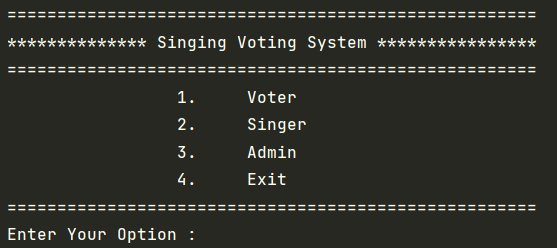
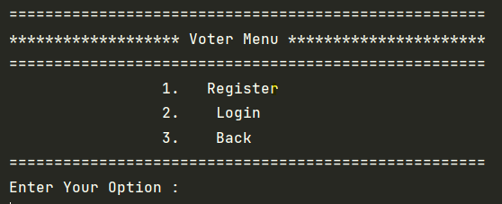
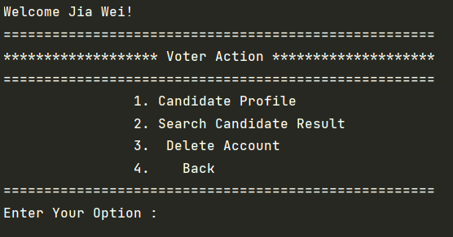
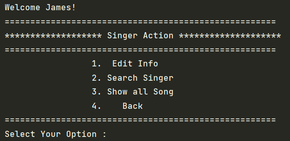
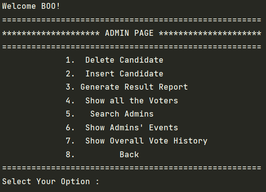

## <b>TARUMT Singing Idols Voting System</b>

This is a Student Singing Contest Voting System for BACS 2063 Data Structures and Algorithms

# Developer  
<b><h4>1. Cheok Jia Wei </h4></b>
- Task: Priority Array Queue and Voting Module  

<b><h4>2. Ong Tzi Min </h4></b>
- Task: Doubly Linked List and Voter Module  

<b><h4>3. Boo Zheng Feng </h4></b>
- Task: AVL Tree and Admin Module  

<b><h4>4. Tan Jun Keat </h4></b>
- Task: Hashmap and Singer Module   

IDE: Intellij IDEA   

## Package Description

1. adt = Abstract Datatype specification and implementation  
2. client = Client program that handle the module  
3. driver = The combination of whole Client, entity and adt to form a working system  
4. entity = Entity of each object   

## ADT used in this program

Instructions: Read the java interface files for understand the method to manipulate each adt  
1. AVLTree = AVLTreeInterface  
2. DoublyLinkList = DoublyLinkListInterface  
3. HashMapInterface = MyHashMap  
4. PriorityQueue = PriorityQueueInterface   

## Steps to use our program 

1. Main Menu  
 
Press 1 to select Voter Menu  
Press 2 to select Singer Menu  
Press 3 to select Admin Menu  
Press 4 to Exit   

<b>Voter </b>

 
Press 1 to Register as Voter  
Press 2 to Login as Voter  
Press 3 to Go Back to Main Menu   

The system will register the voter account into DoublyLinkList and voter is able to continue login  

 
Press 1 to Display all available candidate and voter is able to either cast or edit their votes  
Press 2 to Search for specific candidate and display their current vote score  
Press 3 to Delete voter's current account  
Press 4 to go back to Main Menu   

<b> Singer </b> 

Note: User is able to access this page by pressing 2 in Main menu  
 
Press 1 to edit Singer's individual information  
Press 2 to Search for other Singer's Profile  
Press 3 to Show all songs that Singer had performed  
Press 4 to Go Back to Main Menu   

<b> Admin </b> 

Note: User is able to access this page by pressing 3 in Main menu  
 
Press 1 to delete a certain candidate by searching their singerID 
Press 2 to insert a new candidate  
Press 3 to Generate Top 3 Candidate Vote Result which consists of Percentage of votes  
Press 4 to Show all Voters in this system  
Press 5 to search for a specific admin  
Press 6 to show event handled by admins  
Press 7 to show Overall vote history to see what is the past history of vote activities  
Press 8 to Go back to Main Menu  

